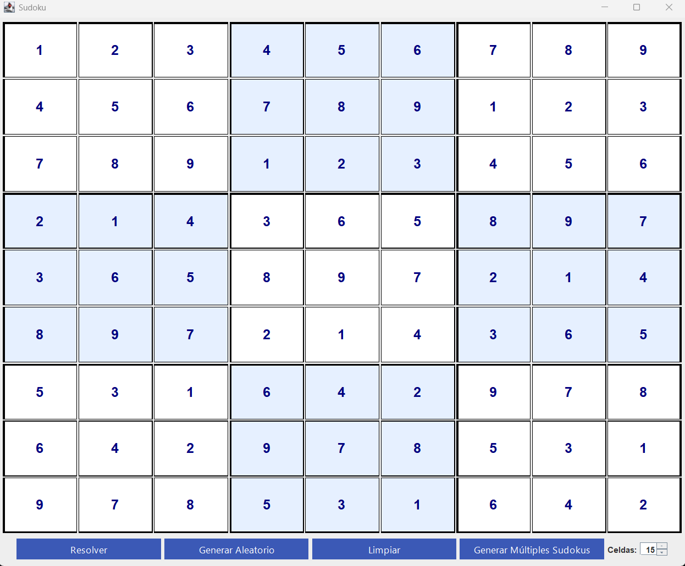
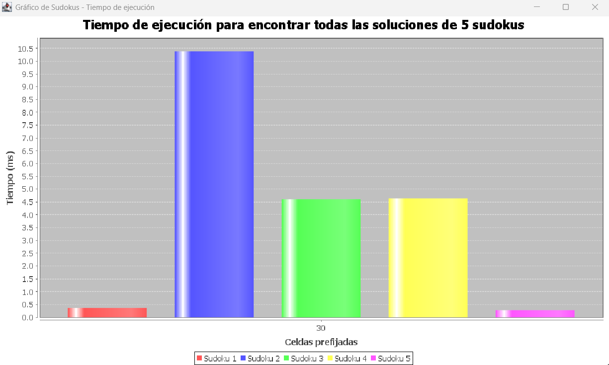

# Sudoku Solver & Analyzer (Java + Backtracking)

Aplicación de escritorio de alto rendimiento para la resolución, generación y análisis de tableros de Sudoku. El núcleo del sistema implementa un algoritmo de **Backtracking** (fuerza bruta optimizada) capaz de encontrar todas las soluciones posibles para un tablero dado o determinar su inviabilidad.

## Funcionalidades Principales:
- **Algoritmo de Resolución (Backtracking):** Motor lógico recursivo que rellena y valida celdas automáticamente, permitiendo encontrar múltiples soluciones si el tablero lo permite.
- **Arquitectura Reactiva (Observer Pattern):** Implementación estricta del patrón Observador para desacoplar la lógica del juego de la interfaz gráfica, garantizando actualizaciones de UI en tiempo real sin dependencias cruzadas.
- **Análisis de Rendimiento (JFreeChart):** Módulo de benchmarking que genera tableros aleatorios y compara gráficamente los tiempos de ejecución del algoritmo en milisegundos.
- **Generador Dinámico:** Creación de tableros con dificultad ajustable mediante la selección de celdas pre-fijadas (Semillas).
- **Validación en Tiempo Real:** Sistema de reglas que impide movimientos ilegales según restricciones de fila, columna y subcuadrícula (3x3).

## Tecnologías:
- **Lenguaje:** Java (JDK 17+).
- **GUI:** Java Swing (Diseño de grilla personalizada).
- **Patrones de Diseño:** MVC (Modelo-Vista-Controlador) + Observer.
- **Librerías:** JFreeChart (Visualización de datos estadísticos).

## Capturas:

*Interfaz limpia con validación visual de celdas fijas vs. editables.*

*Interfaz con grilla completa a traves de Backtracking.*

*Gráfico generado por JFreeChart comparando la eficiencia del algoritmo en múltiples tableros.*

## Estructura del Proyecto:
- **/src/logica:** Contiene el motor de Backtracking (`Tablero`), reglas (`Validador`) y entidades (`Celda`).
- **/src/interfaz:** Implementación de Swing y escuchas de eventos (`PantallaPrincipal`).
- **/src/patrones:** Interfaces para la implementación del patrón Observer.

## Configuración y Ejecución:
1. Clonar el repositorio.
2. Importar en Eclipse/IntelliJ/NetBeans.
3. **Importante:** Agregar la librería `jcommon` y `jfreechart` al Build Path del proyecto.
4. Ejecutar la clase `Main`.
5. Usar el panel derecho para "Generar" un nuevo juego o "Resolver" el actual.

---
**Autor:** [Matias Fauda] - [Tu LinkedIn]
*Proyecto académico realizado en colaboración con: Tobias Cabral y Alan Valdiviezo (UNGS).*
